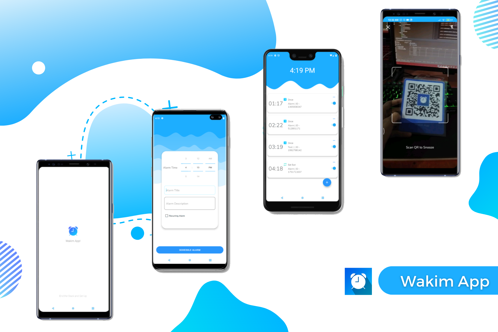
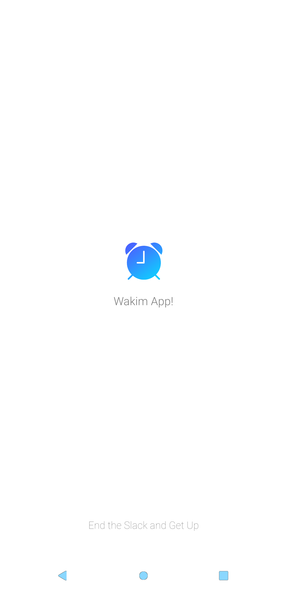
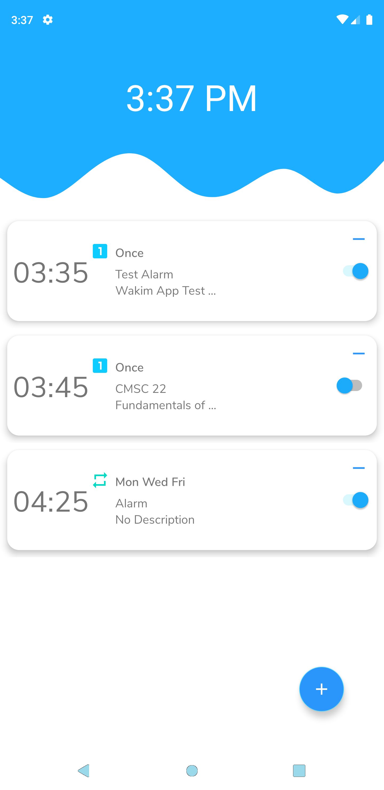

<!-- PROJECT LOGO -->
 

  

  <h3 align="center">Wakim App</h3>

  

    CMSC 22 Final Project
     
    <a href="https://github.com/Kim-Arcena/Wakim"><strong>Explore the docs »</strong></a>
     
     
    <a href="https://github.com/Kim-Arcena/Wakim">View Demo</a>
    ·
    <a href="https://github.com/Kim-Arcena/Wakim/issues">Report Bug</a>
    ·
    <a href="https://github.com/Kim-Arcena/Wakim/issues">Request Feature</a>
  

  <!-- ABOUT THE PROJECT -->
  <h2>About the Project</h2>

  

  We are tasked to develop a project where they will apply not only the basics of Java programming, but also Java design patterns, and best practices in Java.
  Preferably a project that is related to our hobbies or interests yet I decided to develop a project that could personally benefit me.

  <h3>Overview:</h3>

  <ul>
    <li>Native android Application featuring an alarm system that would force me to wake up by scanning a specific QR Code.</li>
    <li>CRUD application with Room Database</li>
    <li>Uses Java design patterns and best practices</li>
  </ul>

 
  <!-- FEATURES -->
  <h2>Features</h2>
    <ol>
      <li>Record Alarm Time</li>
      <li>Alarm Manager and a Pending Intent are used to schedule an alarm.</li>
      <li>Using a Broadcast Receiver to start the Alarm Service.</li>
      <li>Manage alarm dismissal by Scanning a QR Code.</li>
      <li>Handle Alarm Enabling and Disabling</li>
      <li>Perform CRUD (Create, Read, Update, Delete) operations with Room Databse.</li>
    </0l>

  <!-- DESIGN PATTERNS -->
  <h2>Design Patterns</h2>
    <h3>MVVM Architectural Design Pattern</h3>
    
    
Image Source: https://www.researchgate.net/figure/The-Model-View-ViewModel-MVVM-architectural-pattern-In-MVVM-the-View-layer-is_fig3_275258051 
 
    
The app will be built using the <b>Model View ViewModel (MVVM) software design pattern.</b> This aids in the creation of a separation of considerations for components within your app, which simplifies the maintenance of your code base over time. Some of the Jetpack architecture components used in this app includes LiveData for enabling the MVVM design pattern, the Navigation architecture component to transition between screens in our app, and the Room persistence library for storing user data. When the user create, update and delete an alarm, the CreateAlarmFragment class use the MVVM design pattern to perform CRUD operations instances of the Alarm model into the Room Database via a ViewModel and a Repository.

    <ol>
        <h3><li>Creational Design Pattern</li></h3>
            <h4>Factory Design Pattern</h4>
            
 Static factory methods allow us to initialize and configure a new Fragment without using its constructor and extra setter methods. It is best practice to provide static factory methods for utilizing fragments since it encapsulates and isolates the actions necessary to setup the object from the client.

            <h4><b>Singleton Design Pattern</b></h4>
            
 When creating an AppDatabase object, the singleton design pattern is recommended. Each RoomDatabase instance is fairly expensice, and I hardly require access to numerous instances within a single process.

        <h3><li>Behavioral Design Pattern</li></h3>
            <h4>Observer Design Pattern</h4>
            
The Observer pattern defines a one-to-many dependency between objects. When one object changes state, its dependents get a notification and updates automatically.
It can use it for operations of indeterminate time, such as API calls. I have used it to respond to user input using the onManageListener interface.

        <h3><li>Structural Design Pattern</li></h3>
        <h4>Adapter Design Pattern</h4>
        
I used this design pattern to a create dynamic alert list using RecyclerView (can be found in the alarmList package). Each RecyclerView has its own Adapter. The Adapter is in charge of mapping our models to their appropriate View components (ViewHolders), thereby adhering to the traditional Adapter design pattern definition. These two classes (Adapter and ViewHolder) collaborate to establish how your data is displayed. The ViewHolder is a View wrapper that includes the layout for a single item in the list. As needed, the Adapter generates ViewHolder objects and sets the data for those views.

    </ol>

  <!-- BEST PRACTICES -->
  <h2>Best Practices</h2>
    <ul>
      <li>Proper naming conventions</li>
      <li>Averting from unnecessary objects creation</li>
      <li>Avoid redundant code blocks(initialization)</li>
      <li>Ordering Class Members by Scopes</li>
      <li>Organize codes by grouping packages according to usage</li>
      <li>Using the recommended android architecture</li>
      <li>Proper usage of Activity LifeCycle</li>
      <li>Utilized proven libraries </li>
    </ul>

  <!-- PROJECT SETUP -->
  <h2>Project Setup</h2>
    <ol>
        <li>Download the Zip from the website or clone from Github Desktop. (Turn off VCS integration - Optional)</li>
        <li>Copy the extracted folder into your AndroidStudioProjects folder, which must include the hidden.git folder. (Optional)</li>
        <li>Open Android Studio.<b> Go to File -> New -> Import Project.</b> Then choose the specific project you want to import and then click <b> Next->Finish.</b></li>
        <li>It will build the Gradle automatically and it will be ready to use.</li>
    </ol>
    <h3>Possible errors that you may encounter and how to solve it.</h3>
    
<b>Error:package android.support.v4.app does not exist. </b> To fix it go to <b>Gradle Scripts->build.gradle(Module:app)</b> and the add the dependecies:
  
    <pre>
      dependencies {      
          compile fileTree(dir: 'libs', include: ['*.jar'])  
          compile 'com.android.support:appcompat-v7:21.0.3'  
      }
     </pre>
     
<b>Error:SDK location not found. Define location with sdk.dir in the local.properties file or with an ANDROID_HOME environment variable.</b>
        <b>Delete</b> the following files and go to <b>File -> Invalidate Cache / Restart.</b>

     
      .idea/gradle.xml
      .idea/workspace.xml
     
    

  <!-- APP SCREENSHOT -->
  <h2>Gallery</h2>
  <h3>App Screenshots</h3>
  
  
  
  
   
  <h3>QR Codes for Dismissal</h3>
  
  
  

  <!-- JAVA DOCUMENTATION (JAVADOC) -->
  <h2>Java Documentation (JavaDoc)</h2>
  <a href="https://github.com/Kim-Arcena/Wakim/releases"><strong>Check Release</strong></a>

  <!-- EXECUTABLE APK FILE -->
  <h2>Executable APK File</h2>
  <a href="https://github.com/Kim-Arcena/Wakim/releases"><strong>Check Release</strong></a>

